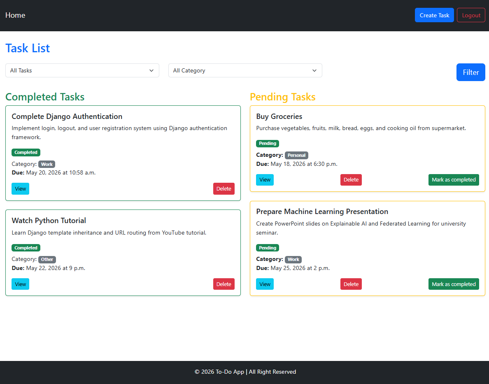
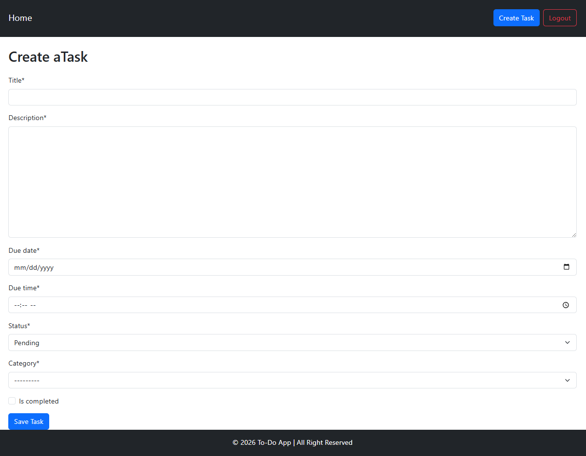
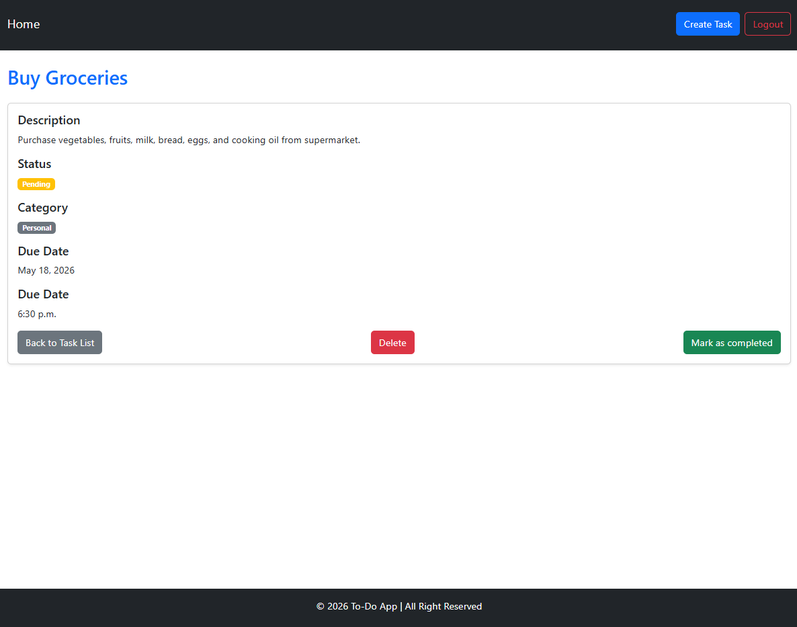

# Django To-Do App

A simple Task Management web application built with Django.  
Users can create, manage, filter, and complete tasks with authentication support.

---

## Features

- User Registration & Login
- Create Tasks
- Delete Tasks
- Mark Tasks as Completed
- Filter by Status and Category
- Completed & Pending Task Sections
- Responsive Bootstrap UI

---

## Technologies Used

- Python
- Django
- SQLite3
- Bootstrap 5

---

## Installation

Clone the repository:

```bash
git clone https://github.com/your-username/to-do.git
cd to-do
```

Create virtual environment:

```bash
python -m venv venv
```

Activate virtual environment:

### Windows

```bash
venv\Scripts\activate
```

Install dependencies:

```bash
pip install -r requirements.txt
```

Run migrations:

```bash
python manage.py migrate
```

Start server:

```bash
python manage.py runserver
```

Open:

```bash
http://127.0.0.1:8000/
```

---

## Screenshots

### Task List



### Create Task



### Task Detail



---

## .gitignore

```gitignore
venv/
__pycache__/
db.sqlite3
*.pyc
```

---

## Author

Developed by Md Fahim Shahriar